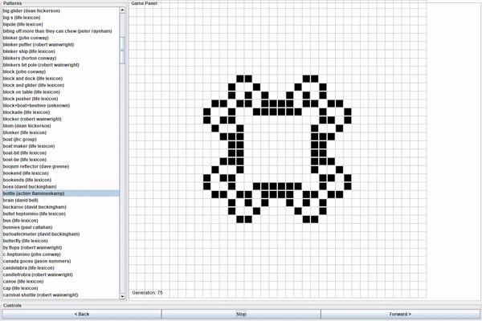

## gui-life

This was my final piece of coursework for my OOP
course during my first year at university.

The task was to impliment the logic for [Conways Game of Life](https://en.wikipedia.org/wiki/Conway%27s_Game_of_Life) 
as well as a GUI made in Swing.

This project was a good chance to demonstrate my understanding of the principles of OOP. 
 
 ### Example 
 
 